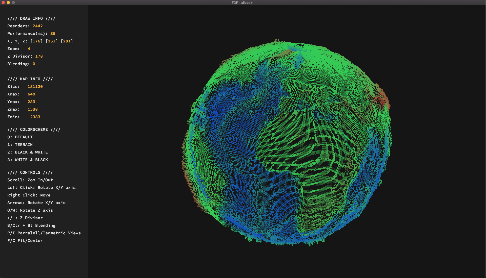
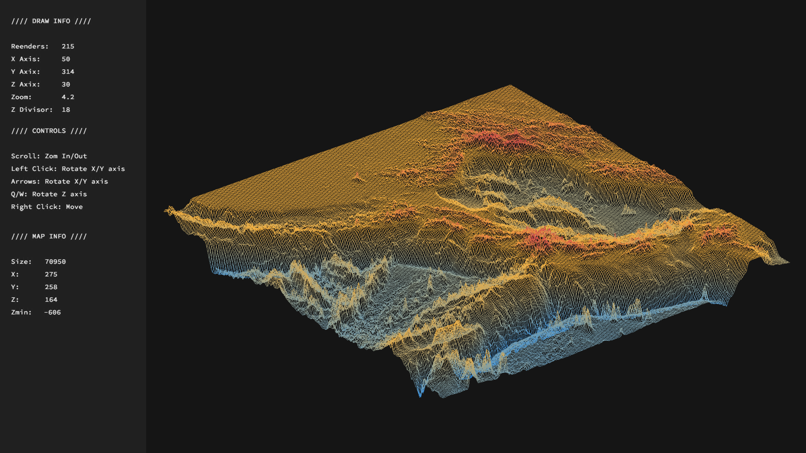
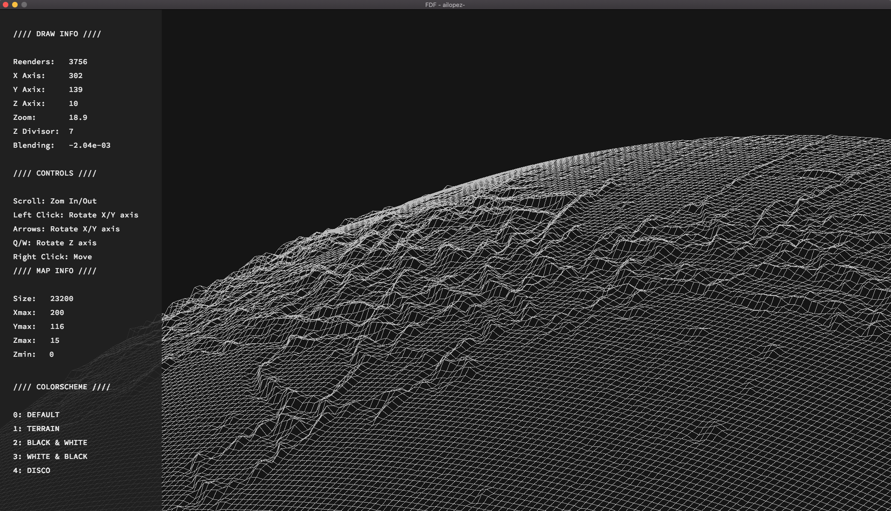

<h1 align="center">
  <br>
  
  <br>
  FdF - 3D Wireframe Viewer
</h1>

<p align="center">
  <b><i>A sophisticated 3D engine for rendering relief landscapes from simple coordinates.</i></b><br>
  Developed as part of the 42 Barcelona curriculum.
</p>

<p align="center">
  
  
  
  
</p>

---

## 📽️ Overview

**FdF** (Fil de Fer) is a project that explores the basics of 3D graphics. It takes a representation of a 3D landscape (a file with coordinates and altitudes) and renders it as a wireframe mesh using various mathematical transformations.

### ✨ Key Features
- 🔄 **Full 3D Control**: Smooth rotation on X, Y, and Z axes.
- 🔍 **Dynamic Zoom & Translation**: Navigate your maps with ease.
- 📐 **Multiple Projections**: Switch between Isometric and Parallel views.
- 🎨 **Adaptive Color Schemes**: 5+ preset themes (Terrain, Earth, B&W, etc.).
- 🛠️ **Live UI**: Real-time performance metrics and control menu.
- 🌟 **Extra Visuals**: Star mode, shadow effects, and adjustable line blending.

---

## 📸 Gallery

<p align="center">
  
  
  <br>
  
  
</p>

---

## 🚀 Getting Started

### Prerequisites

#### Linux Users
```bash
sudo apt-get install gcc make xorg libxext-dev libbsd-dev
```

#### macOS Users
The project utilizes MiniLibX, which requires the native Cocoa framework. Ensure you have Xcode Command Line Tools installed.

### Installation

1. **Clone the repository** (including submodules for libraries):
   ```bash
   git clone --recursive https://github.com/ailopez-o/42Barcelona-FdF.git
   cd 42Barcelona-FdF
   ```

2. **Compile the project**:
   ```bash
   make
   ```

### Running the Viewer
Launch the program with a valid `.fdf` map file found in the `maps/` directory:
```bash
./fdf maps/42.fdf
```

---

## 🕹️ Controls

| Category | Key/Action | Description |
| :--- | :--- | :--- |
| **Navigation** | `Mouse Wheel` | Zoom In / Out |
| | `Left Click + Drag` | Rotate X / Y axis |
| | `Right Click + Drag` | Translate Map |
| | `Arrows` | Rotate X / Y axis |
| | `Q / W` | Rotate Z axis |
| **Views** | `I` | Isometric Projection |
| | `P` | Parallel Projection |
| | `G` | GEO View Toggle |
| | `F` | Fit to Screen |
| | `C` | Center Map |
| **Visuals** | `1-4` | Switch Color Schemes |
| | `L` | Toggle Lines |
| | `D` | Toggle Dots |
| | `X` | Extra Wired Mesh |
| | `S` | Start Magic (Stars) |
| | `B / Cmd+B` | Blending Range +/- |
| | `+/-` | Z-Axis Altitude Scale |
| **General** | `R` | Reset to Defaults |
| | `ESC` | Close Program |

---

## 🧠 Technical Details

The engine core is built from scratch in C, implementing:
- **Matrix Transformations**: Rotation, Translation, and Scaling matrices for 3D manipulation.
- **Bresenham's Algorithm**: High-performance line drawing calculation.
- **Altitude Interpolation**: Custom color gradients based on Z-axis values.

---

## 📚 Resources & Credits

<details>
<summary>View All Documentation & Inspiration</summary>

### 📐 3D Transformations & Math
- [3D Transformations (Theory)](http://di002.edv.uniovi.es/~rr/Tema2.pdf)
- [Geometric Transformations 3D (PDF)](https://www.cs.buap.mx/~iolmos/graficacion/5_Transformaciones_geometricas_3D.pdf)
- [Arbitrary Axis Rotation](http://inside.mines.edu/fs_home/gmurray/ArbitraryAxisRotation/)
- [3D Point Rotation Calculator](https://www.mathforengineers.com/math-calculators/3D-point-rotation-calculator.html#google_vignette)
- [Rotation Matrices (Video)](https://www.youtube.com/watch?v=p4Iz0XJY-Qk)
- [Orthographic Projection](http://learnwebgl.brown37.net/08_projections/projections_ortho.html)

### 💻 Graphics & MiniLibX
- [MiniLibX Tutorial](https://gontjarow.github.io/MiniLibX/mlx-tutorial-create-image.html)
- [Bresenham's Algorithm](https://en.wikipedia.org/wiki/Bresenham%27s_line_algorithm)
- [ft_libgfx (Graphics Branch)](https://github.com/qst0/ft_libgfx#the-graphics-branch)
- [Scratchapixel (Computer Graphics)](https://www.scratchapixel.com/index.php?redirect)
- [OpenGL Tutorial (Archive)](https://web.archive.org/web/20150225192611/http://www.arcsynthesis.org/gltut/index.html)
- [Gradient Rendering Guide](https://dev.to/freerangepixels/a-probably-terrible-way-to-render-gradients-1p3n)

### 🏫 42 Network Specifics
- [42 Docs (General)](https://harm-smits.github.io/42docs/)
- [42 Map Generator](https://github.com/jgigault/42MapGenerator)

</details>

**Created by [ailopez-o](https://github.com/ailopez-o)**  
*42 Barcelona*
